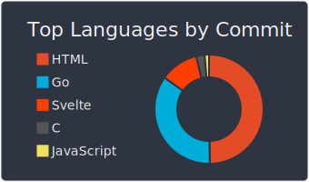

# :sparkling_heart: Contributions

Isometric view of contributions in the last year. Languages pie is based on recent commits. Greener pic from 13rd Oct (before the company moved) [here](//raw.githubusercontent.com/kokizzu/kokizzu/1f9cb8e7c8c6c5712c22b13024a8296c5245f6e1/profile-3d-contrib/profile-night-green.svg)

# :pencil2: Latest Blog Posts

<!-- BLOG-POST-LIST:START -->
- [Clickhouse in Kubernetes / Minikube using Bitnami Helm Charts](https://kokizzu.blogspot.com/2024/03/clickhouse-in-kubernetes-minikube-using.html)
- [Dump/export Cassandra/BigQuery tables and import to Clickhouse](https://kokizzu.blogspot.com/2024/02/dump-cassandrabigquery-and-import-to.html)
- [Writing UDF for Clickhouse using Golang](https://kokizzu.blogspot.com/2024/02/writing-udf-for-clickhouse-using-golang.html)
- [OLLAMA with AMD GPU &lpar;ROCm&rpar;](https://kokizzu.blogspot.com/2024/01/ollama-with-amd-gpu-rocm.html)
- [Benchmarking LLM models](https://kokizzu.blogspot.com/2023/12/benchmarking-llm-models.html)
- [Install Ruby 2.7 on Ubuntu 22.04](https://kokizzu.blogspot.com/2023/11/install-ruby-27-on-ubuntu-2204.html)
- [mTLS using Golang Fiber](https://kokizzu.blogspot.com/2023/11/mlts-using-golang-fiber.html)
- [Benchmarking docker-volume vs mount-fs vs tmpfs](https://kokizzu.blogspot.com/2023/10/benchmarking-docker-volume-vs-mount-fs.html)
- [NATS: at-most once Queue / simpler networking](https://kokizzu.blogspot.com/2023/10/nats-at-most-once-queue-simpler.html)
- [Chisel: Ngrok local-tunnel Alternative](https://kokizzu.blogspot.com/2023/09/chisel-ngrok-local-tunnel-alternative.html)
- [Free VPN on Linux](https://kokizzu.blogspot.com/2023/08/free-vpn-on-linux.html)
- [Using Vault with Go](https://kokizzu.blogspot.com/2023/07/using-vault-with-go.html)
- [KEDA Kubernetes Event-Driven Autoscaling](https://kokizzu.blogspot.com/2023/07/keda-kubernetes-event-driven-autoscaling.html)
- [Simple Websocket Echo Benchmark](https://kokizzu.blogspot.com/2023/06/simple-websocket-echo-benchmark.html)
- [Dockerfile vs Nixpacks vs ko](https://kokizzu.blogspot.com/2023/05/dockerfile-vs-nixpacks.html)
- [GeoSearch Database Benchmark](https://kokizzu.blogspot.com/2023/04/geosearch-database-benchmark.html)
- [How to use DNS SDK in Golang](https://kokizzu.blogspot.com/2023/04/how-to-use-dns-sdk-in-golang.html)
- [Lua Tutorial, Example, Cheatsheet](https://kokizzu.blogspot.com/2023/02/lua-tutorial-example-cheatsheet.html)
- [CockroachDB Benchmark on Different Disk Types](https://kokizzu.blogspot.com/2022/12/cockroachdb-benchmark-on-different-disk.html)
- [Map to Struct and Struct to Map Golang Benchmark 2022 Edition](https://kokizzu.blogspot.com/2022/12/map-to-struct-and-struct-to-map-golang.html)
<!-- BLOG-POST-LIST:END -->

# :dizzy: Metrics and Statistics

</img>

# :four_leaf_clover: Other Public Profile

<table>
    <tr>
        <td>

        </td><td>

        </td><td>

        </td><td>

        </td>
    </tr>
</table>

# 🥇 Featured Projects

- [ch-timed-buffer](//github.com/kokizzu/ch-timed-buffer)  - Clickhouse insert buffer library for Go
- [goproc](//github.com/kokizzu/goproc)  - process runner library for Go
- [gotro](//github.com/kokizzu/gotro)  - collection of Go helper libraries and web framework
- [hugedbbench](//github.com/kokizzu/hugedbbench)  - collection of database benchmarks
- [id64](//github.com/kokizzu/id64)  - 64-bit id generator for Go
- [json5b](//github.com/kokizzu/json5b)  - json5 fork with json5-tag instead of json
- [kokizzu-benchmark](//github.com/kokizzu/kokizzu-benchmark)  - collection of programming language benchmarks
- [lexid](//github.com/kokizzu/lexid)  - compact unique id generator library for Go that can be sorted by creation time
- [list-of-tech-migrations](//github.com/kokizzu/list-of-tech-migrations)  - list of tech migrations from internet
- [replacer](//github.com/kokizzu/replacer)  - command line utility to replace text after specific line
- [street](//github.com/kokizzu/street)  - complex example how to use svelte (svelte-mpa), golang (fiber, gotro), tarantool, clickhouse
- [svelte-mpa](//github.com/kokizzu/svelte-mpa)  - Svelte multipage application starter project
- [uadeco](//github.com/kokizzu/uadeco)  - simple net/http user-agent decorator
- [yamlflatten](//github.com/kokizzu/yamlflatten)  - flatten YAML tree into HCL/JSON-query lines
- [yamlsort](//github.com/kokizzu/yamlsort)  - sort YAML and remove comments

# 🥈 Simple Examples
- [bqEmu1](//github.com/kokizzu/bqEmu1)  - BigQuery emulator example
- [clickhouse1](//github.com/kokizzu/clickhouse1)  - Clickhouse insert buffering example
- [dns1](//github.com/kokizzu/dns1)  - dns manipulation example
- [echogorm1](//github.com/kokizzu/echogorm1)  - echo, MySQL, gorm example
- [fiber1](//github.com/kokizzu/fiber1)  - fiber, MySQL, dockertest, autogold example
- [fibermtls1](//github.com/kokizzu/fibermtls1)  - fiber and mTLS example
- [fiberpgx1](//github.com/kokizzu/fiberpgx1)  - fiber, PostgreSQL, pgx example
- [gingorm1](//github.com/kokizzu/gingorm1)  - Gin, MySQL, gorm example
- [gorm-vs-korm](//github.com/kokizzu/gorm-vs-korm)  - gorm vs korm
- [jeager1](//github.com/kokizzu/jeager1)  - jaeger intergration example with gRPC, HTTP, and NATS
- [otoCrawl](//github.com/kokizzu/otoCrawl)  - web crawling example using Javascript, Ruby, and Python
- [natsmtls1](//github.com/kokizzu/natsmtls1)  - example how to use NATS with mTLS
- [pgx-pq-example](//github.com/kokizzu/pgx-pq-example)  - old pgx vs pg benchmark
- [pglogrepl1](//github.com/kokizzu/pglogrepl1)  - postgres wal log read example
- [prunningRadixTrie](//github.com/kokizzu/prunningRadixTrie)  - prunning radix trie converted from C# version using ChatGPT
- [rabbit1](//github.com/kokizzu/rabbit1)  - rabbitmq example
- [redispubsub1](//github.com/kokizzu/redispubsub1)  - redis at broadcast and least once delivery example (make it behave like kafka)
- [stargate1](//github.com/kokizzu/stargate1)  - cassandra, stargate, golang, and dockertest example
- [sveltefiber](//github.com/kokizzu/sveltefiber)  - fiber, Svelte-MPA example
- [terraform1](//github.com/kokizzu/terraform1)  - Terraform, Kubernetes, KEDA, Prometheus autoscaling example
- [vault1](//github.com/kokizzu/vault1)  - vault, golang example
- [vaultdist1](//github.com/kokizzu/vaultdist1)  - another vault example for storing dnskey, with and without custom vault plugin

# :dragon_face: Visitors
  
