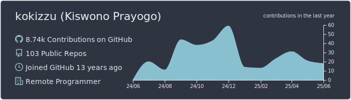
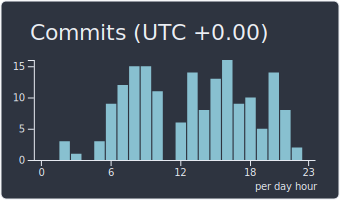

### :pencil2: Latest Blog Posts
<!-- BLOG-POST-LIST:START -->
- [Against Golang Interface{Method}-abuse/pollution](https://kokizzu.blogspot.com/2021/09/fight-against-golang-interfacemethod.html)
- [Remove Secrets from git Repository](https://kokizzu.blogspot.com/2021/09/remove-secrets-from-git-repository.html)
- [Database Patterns of Microservices](https://kokizzu.blogspot.com/2021/08/database-patterns-of-microservices.html)
- [You don&#39;t need Kubernetes](https://kokizzu.blogspot.com/2021/08/you-dont-need-kubernetes.html)
- [Dockerfile Template &lpar;React, Express, Vue, Nest, Angular, GoFiber, Svelte, Django, Laravel, ASP.NET Core, Kotlin, Deno&rpar;](https://kokizzu.blogspot.com/2021/08/dockerfile-template-react-express-vue.html)
- [Mock vs Fake and Classical Testing](https://kokizzu.blogspot.com/2021/07/mock-vs-fake-and-classical-testing.html)
- [Prime Benchmark](https://kokizzu.blogspot.com/2021/07/prime-benchmark.html)
- [Easy Tarantool and ClickHouse Replication Setup](https://kokizzu.blogspot.com/2021/05/easy-tarantool-clickhouse-replication-setup.html)
- [Benchmarking Disks on VPS](https://kokizzu.blogspot.com/2021/05/benchmarking-disks-on-vps.html)
- [Kubernetes IDE/GUI](https://kokizzu.blogspot.com/2021/03/kubernetes-gui.html)
<!-- BLOG-POST-LIST:END -->
