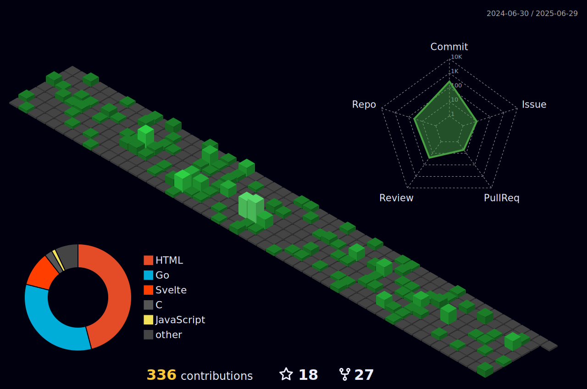

# :sparkling_heart: Contributions

Isometric view of contributions in the last year. Languages pie is based on recent commits

# :pencil2: Latest Blog Posts

<!-- BLOG-POST-LIST:START -->
- [Techempower Framework Benchmark Round 21](https://kokizzu.blogspot.com/2022/07/techempower-framework-benchmark-round-21.html)
- [How to profile your Golang Fiber server](https://kokizzu.blogspot.com/2022/06/how-to-profile-your-golang-fiber-server.html)
- [Getting started with SaltStack Configuration Management](https://kokizzu.blogspot.com/2022/05/getting-started-with-saltstack.html)
- [How to structure/layer your Golang Project &lpar;or whatever language you are using&rpar;](https://kokizzu.blogspot.com/2022/05/how-to-structure-layer-your-golang-project.html)
- [Getting started with Trino](https://kokizzu.blogspot.com/2022/05/getting-started-with-trino.html)
- [Start/restart Golang or any other binary program automatically on boot/crash](https://kokizzu.blogspot.com/2022/04/startrestart-golang-or-any-other-binary.html)
- [Automatic Load Balancer Registration/Deregistration with NATS or FabioLB](https://kokizzu.blogspot.com/2022/04/automatic-load-balancer.html)
- [Georeplicable Architecture Tech Stacks](https://kokizzu.blogspot.com/2022/04/georeplicable-architecture-tech-stacks.html)
- [Getting started with Ansible](https://kokizzu.blogspot.com/2022/03/getting-started-with-ansible.html)
- [Move docker Data Directory to Another Partition](https://kokizzu.blogspot.com/2022/03/move-docker-data-directory-to-another.html)
- [1 million Go goroutine vs C# task](https://kokizzu.blogspot.com/2022/03/1-million-go-goroutine-vs-c-task.html)
- [Getting started with Cassandra or ScyllaDB](https://kokizzu.blogspot.com/2022/03/getting-started-with-cassandra.html)
- [C# vs Go in Simple Benchmark](https://kokizzu.blogspot.com/2022/02/c-vs-go-in-simple-benchmark.html)
- [Getting started with Kubernetes](https://kokizzu.blogspot.com/2022/02/getting-started-with-kubernetes.html)
- [Easy minimal Ubuntu VM on any OS](https://kokizzu.blogspot.com/2022/01/easy-minimal-ubuntu-vm.html)
- [String Associative Array and CombSort Benchmark 2021 Edition](https://kokizzu.blogspot.com/2021/12/string-associative-array-and-combsort.html)
- [Object Storage Service with CDN](https://kokizzu.blogspot.com/2021/12/storage-service-with-cdn.html)
- [Coolest PaaS/IaaS I&#39;ve ever use: Jelastic](https://kokizzu.blogspot.com/2021/12/coolest-paas-ive-ever-use-jelastic.html)
- [Kafka vs RedPanda Benchmark &lpar;also Tarantool and Clickhouse as queue&rpar;](https://kokizzu.blogspot.com/2021/11/kafka-vs-redpanda-benchmark.html)
- [Alternative Strategy for Dependency Injection &lpar;lambda-returning vs function-pointer&rpar;](https://kokizzu.blogspot.com/2021/11/alternative-strategy-for-dependency.html)
<!-- BLOG-POST-LIST:END -->

# :dizzy: Metrics and Statistics

# :four_leaf_clover: Other Public Profile

<table>
    <tr>
        <td>

        </td><td>

        </td><td>

        </td>
    </tr>
</table>

# 🥇 Featured Projects

- [ch-timed-buffer](//github.com/kokizzu/ch-timed-buffer)  - Clickhouse insert buffer library for Go
- [goproc](//github.com/kokizzu/goproc)  - process runner library for Go
- [gotro](//github.com/kokizzu/gotro)  - collection of Go helper libraries and web framework
- [hugedbbench](//github.com/kokizzu/hugedbbench)  - collection of database benchmarks
- [id64](//github.com/kokizzu/id64)  - 64-bit id generator for Go
- [kokizzu-benchmark](//github.com/kokizzu/kokizzu-benchmark)  - collection of programming language benchmarks
- [lexid](//github.com/kokizzu/lexid)  - compact unique id generator library for Go that can be sorted by creation time
- [list-of-tech-migrations](//github.com/kokizzu/list-of-tech-migrations)  - list of tech migrations from internet
- [replacer](//github.com/kokizzu/replacer)  - command line utility to replace text after specific line
- [svelte-mpa](//github.com/kokizzu/svelte-mpa)  - Svelte multipage application starter project
