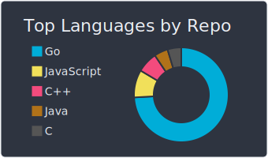

### :pencil2: Latest Blog Posts
<!-- BLOG-POST-LIST:START -->
- [Coolest PaaS/IaaS I&#39;ve ever use: Jelastic](https://kokizzu.blogspot.com/2021/12/coolest-paas-ive-ever-use-jelastic.html)
- [Kafka vs RedPanda Benchmark &lpar;also Tarantool and Clickhouse as queue&rpar;](https://kokizzu.blogspot.com/2021/11/kafka-vs-redpanda-benchmark.html)
- [Alternative Strategy for Dependency Injection &lpar;lambda-returning vs function-pointer&rpar;](https://kokizzu.blogspot.com/2021/11/alternative-strategy-for-dependency.html)
- [Databases with Automatic Rebalance Benchmark &lpar;TIDB vs YugabyteDB vs CockroachDB&rpar;](https://kokizzu.blogspot.com/2021/11/databases-with-automatic-rebalance.html)
- [Against Golang Interface{Method}-abuse/pollution](https://kokizzu.blogspot.com/2021/09/fight-against-golang-interfacemethod.html)
- [Remove Secrets from git Repository](https://kokizzu.blogspot.com/2021/09/remove-secrets-from-git-repository.html)
- [Database Patterns of Microservices](https://kokizzu.blogspot.com/2021/08/database-patterns-of-microservices.html)
- [You don&#39;t need Kubernetes](https://kokizzu.blogspot.com/2021/08/you-dont-need-kubernetes.html)
- [Dockerfile Template &lpar;React, Express, Vue, Nest, Angular, GoFiber, Svelte, Django, Laravel, ASP.NET Core, Kotlin, Deno&rpar;](https://kokizzu.blogspot.com/2021/08/dockerfile-template-react-express-vue.html)
- [Mock vs Fake and Classical Testing](https://kokizzu.blogspot.com/2021/07/mock-vs-fake-and-classical-testing.html)
- [Prime Benchmark](https://kokizzu.blogspot.com/2021/07/prime-benchmark.html)
- [Easy Tarantool and ClickHouse Replication Setup](https://kokizzu.blogspot.com/2021/05/easy-tarantool-clickhouse-replication-setup.html)
- [Benchmarking Disks on VPS](https://kokizzu.blogspot.com/2021/05/benchmarking-disks-on-vps.html)
- [Kubernetes IDE/GUI](https://kokizzu.blogspot.com/2021/03/kubernetes-gui.html)
- [Pyroscope: Continuous Tracing in Go, Python, or Ruby](https://kokizzu.blogspot.com/2021/03/pyroscope-continuous-tracing-in-go.html)
- [GOPS: Trace your Golang service with ease](https://kokizzu.blogspot.com/2021/01/gops-trace-your-golang-service-with-ease.html)
- [Learn Python in X minutes](https://kokizzu.blogspot.com/2021/01/learn-python-in-x-minutes.html)
- [Golang Serialization Benchmark 2020 Edition](https://kokizzu.blogspot.com/2020/12/golang-serialization-benchmark-2020.html)
- [String Associative Array and CombSort Benchmark 2020 Edition](https://kokizzu.blogspot.com/2020/12/string-associative-array-and-combsort.html)
- [Tarantool: In-memory SQL Hybrid Database](https://kokizzu.blogspot.com/2020/11/tarantool-in-memory-sql-hybrid-database.html)
<!-- BLOG-POST-LIST:END -->

